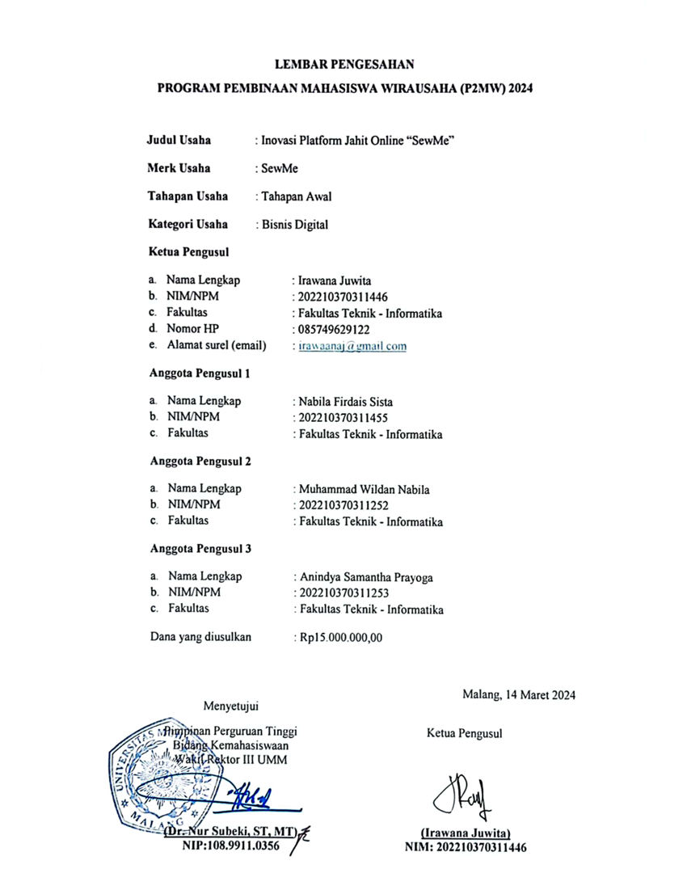

# 🧵 SewMe — Platform Marketplace Layanan Jahit

  

  <strong>Solusi Digital untuk Kebutuhan Jahit dan Konveksi</strong> 
  Platform berbasis web yang menghubungkan pelanggan dengan penjahit lokal untuk memenuhi kebutuhan jahit dan kustomisasi pakaian secara lebih mudah dan terintegrasi.

  
  
  
  
  

  
  
  
  
  
  
  
  
  

  
  
  
  

---

# 🟢 Tentang Proyek

**SewMe** merupakan platform marketplace layanan jahit yang dikembangkan sebagai bagian dari **Program Pembinaan Mahasiswa Wirausaha (P2MW) 2024**.

Platform ini dirancang untuk menghubungkan pelanggan dengan penjahit lokal melalui layanan digital yang mencakup pencarian penjahit, eksplorasi portofolio, pemesanan pakaian secara kustom, pembayaran digital, hingga pemantauan status pesanan.

SewMe hadir sebagai solusi untuk mendigitalisasi layanan jahit konvensional sekaligus membuka peluang bagi penjahit lokal dan UMKM untuk memperluas jangkauan pasar melalui platform digital.

---

## 🏆 Pencapaian Proyek

- 🥇 Startup yang didanai melalui **P2MW 2024**
- 💰 Memperoleh pendanaan nasional sebesar **Rp15.000.000**
- 🏅 Berkontribusi dalam pencapaian **Universitas Muhammadiyah Malang** sebagai salah satu perguruan tinggi penerima pendanaan P2MW nasional
- 👥 Memiliki **124 pengguna aktif**
- 🧵 Memiliki **21 mitra penjahit terverifikasi**
- 💰 Mencatat pendapatan sebesar **Rp1.480.000 dalam 3 bulan**
- 📈 Mencapai pertumbuhan pengguna sebesar **15% per bulan**

---

## 🎯 Tujuan Pengembangan

SewMe dikembangkan dengan beberapa tujuan utama:

1. **Mendigitalisasi layanan jahit** agar pelanggan dapat memperoleh layanan secara lebih mudah dan praktis.
2. **Menghubungkan pelanggan dengan penjahit lokal** melalui sebuah marketplace yang terintegrasi.
3. **Membantu penjahit dan UMKM** memperluas jangkauan pasar serta memperkenalkan portofolio dan produk mereka secara digital.
4. **Menyediakan pengalaman pemesanan yang terstruktur**, mulai dari pemilihan penjahit hingga proses pembayaran dan pemantauan pesanan.
5. **Mendorong transformasi digital UMKM** pada sektor jasa jahit dan konveksi.

---

## ✨ Fitur Utama

### 👤 Pelanggan

- Pencarian penjahit
- Eksplorasi portofolio penjahit
- Input ukuran pakaian secara kustom
- Keranjang belanja
- Checkout pesanan
- Pembayaran melalui Midtrans
- Pelacakan status pesanan
- Pemberian ulasan

### 🧵 Penjahit

- Pengelolaan toko
- Pengelolaan produk
- Tambah, ubah, dan hapus produk
- Pengelolaan pesanan
- Dashboard penjualan

### ⚙️ Administrator

- Verifikasi pengguna
- Pemantauan transaksi
- Pemantauan aktivitas platform
- Analisis data platform

---

## 🔄 Alur Penggunaan Platform

<pre>
Pelanggan
    │
    ▼
Mencari Penjahit
    │
    ▼
Melihat Portofolio
    │
    ▼
Memilih Layanan / Produk
    │
    ▼
Mengisi Ukuran & Detail Pesanan
    │
    ▼
Checkout
    │
    ▼
Pembayaran Digital
    │
    ▼
Proses Pesanan oleh Penjahit
    │
    ▼
Pengiriman
    │
    ▼
Pesanan Diterima
    │
    ▼
Ulasan Pelanggan
</pre>

---

## 🛠️ Teknologi yang Digunakan

| Teknologi | Penggunaan |
|---|---|
| **Laravel 10** | Framework pengembangan aplikasi web |
| **PHP 8** | Bahasa pemrograman utama |
| **Blade** | Template engine |
| **Tailwind CSS** | Pengembangan antarmuka pengguna |
| **MySQL** | Sistem manajemen basis data |
| **Midtrans** | Integrasi pembayaran digital |
| **RajaOngkir** | Integrasi informasi dan perhitungan pengiriman |
| **Vite** | Build tool dan pengelolaan aset |
| **Figma** | Perancangan UI/UX dan prototype |

---

## 👥 Tim Pengembang

| Nama | Peran |
|---|---|
| **Irawana Juwita** | Chief Executive Officer (CEO) |
| **Nabila Firdais Sista** | Chief Marketing Officer (CMO) |
| **Muhammad Wildan Nabila** | Chief Design Officer (CDO) |
| **Anindya Samantha Prayoga** | Chief Technology Officer (CTO) |

---

## 🎨 Peran dan Kontribusi

### Chief Executive Officer (CEO)

Dalam proyek SewMe, saya berperan sebagai **Chief Executive Officer (CEO)** dengan tanggung jawab dalam mengarahkan pengembangan proyek dan memastikan setiap aspek pengembangan berjalan sesuai dengan tujuan bisnis dan kebutuhan pengguna.

Kontribusi yang dilakukan meliputi:

- Merumuskan konsep dan arah pengembangan SewMe.
- Menentukan visi dan arah pengembangan SewMe sebagai platform marketplace layanan jahit.
- Mengembangkan konsep produk berdasarkan permasalahan dan kebutuhan pengguna.
- Mengarahkan strategi pengembangan produk dan prioritas fitur.
- Mengoordinasikan pembagian tugas serta kolaborasi antaranggota tim.
- Mengawasi proses pengembangan dari tahap perencanaan hingga implementasi.
- Mengambil keputusan strategis terkait pengembangan dan keberlanjutan proyek.
- Mengarahkan pengembangan SewMe agar memiliki nilai bisnis dan potensi pengembangan lebih lanjut.

---

## 🎨 Prototype

Prototype dan rancangan antarmuka SewMe dapat diakses melalui Figma:

🔗 [Lihat Prototype SewMe](https://www.figma.com/proto/cMmNkQqkHFaikbPd6onpUN/sewme?node-id=59-2069&t=W8EtpUC6Ani0hOSJ-1&scaling=min-zoom&content-scaling=fixed&page-id=31%3A212)

---

## 🌐 Website

Website SewMe:

🔗 [https://sewme-jahitonline.com](https://sewme-jahitonline.com)

> **Catatan:** Website saat ini sedang tidak aktif.

---

## 📸 Dokumentasi

Dokumentasi proyek dan bukti kegiatan P2MW:

  

---

## 📄 Status dan Lisensi

Proyek SewMe dikembangkan untuk keperluan **akademik, kewirausahaan, pengembangan produk digital, dan penelitian** dalam rangka Program Pembinaan Mahasiswa Wirausaha (P2MW) 2024.

---

### 🧵 Memberdayakan Penjahit Lokal melalui Inovasi Digital

**SewMe — Platform Marketplace Layanan Jahit**

